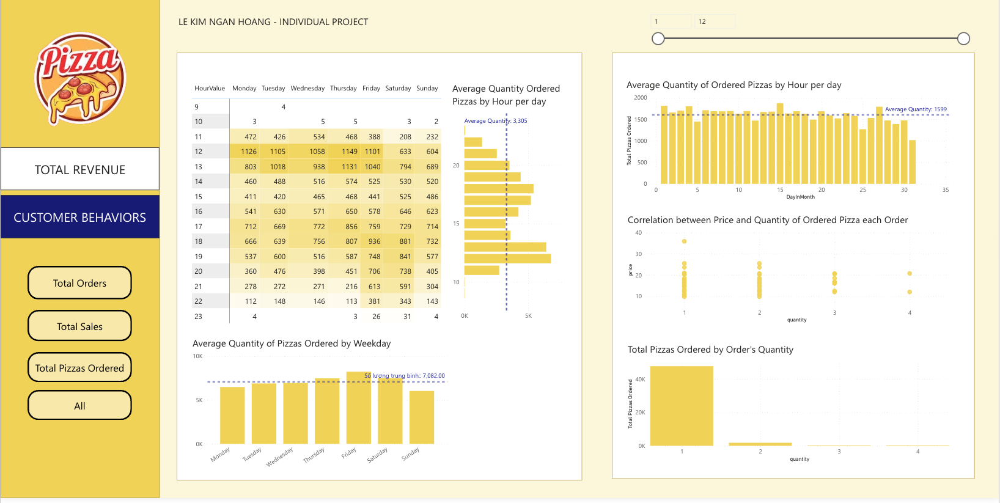

# Plato's Pizza
## Maven Analytics Pizza Challenge

## Business Task
Using Power BI to build dashboard to help with decision-making process and overall operation performance improvement of the 

Several business questions:

* What days and times do we tend to be busiest?
* How many pizzas are we making during peak periods? 
* What are our best and worst selling pizzas?
* What's our average order value?
* How well are we utilizing our seating capacity? (we have 15 tables and 60 seats)

## My Role
A Business Intelligen hired by Plato's Pizza to help use data to help improve performances by tracking operation performance and uncovering customer insights

## About the dataset

* This dataset contains 4 tables in CSV format
* The Orders table contains the date & time that all 5,238 table orders were placed
* The Order Details table contains the different pizzas served with each order in the Orders table, and their quantities
* The Pizzas table contains the size and price for each distinct pizza in the Order Details table, as well as its broader pizza type
* The Pizza Types table contains details on the pizza types in the Pizzas table, including their name as it appears on the menu, the category it falls under, and its list of ingredients

## Insight from Total Revenue
* Total Revenue of Quarter 4 was significantly lower than the first 3 Quarters of the year
* Pizza size XL and XXL earned low quanity of orders and revenue
* 3 Most popular Pizza types: The Big Meat Pizza, The Thai Chicken Pizza, The Five Cheese Pizza
* 3 Most popular Ingredients combo: BBQ Chicken, Pepperoni and Mozarella Cheese

## Insights from Customer Behaviors
* Plato's Pizzas sell the most pizzas on Fridays and Saturdays, with slightly fewer orders reported on Thursdays and Sundays
* The last days of each month (days 25 to 31) observed low number of pizzas ordered
* When ordering more than 1 pizza, customers tend to pick pizzas which lower price
* The majority of orders were for 2 people with 1 pizza, with 15 tables, 60 chairs, the current configuration is more suitable for 4 people
